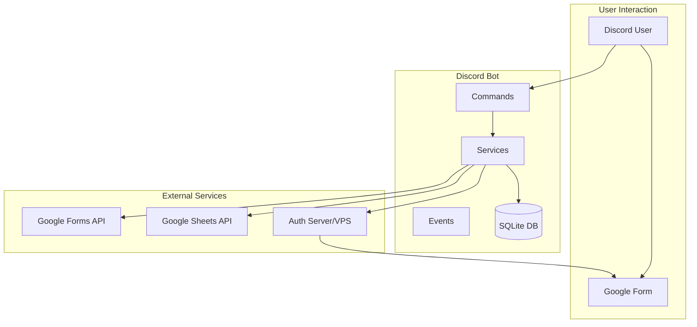

# CAC BOT Google Forms 連携機能 技術設計書

## 1. システム構成図



## 2. モジュール構成

### 2.1 新規追加ファイル構成
```
src/
├── bot/
│   ├── commands/
│   │   └── form.ts              # フォーム管理コマンド
│   ├── buttons/
│   │   └── formAnswer.ts        # 回答ボタンハンドラー
│   └── modals/
│       └── formCreate.ts        # フォーム作成モーダル
├── services/
│   ├── forms/
│   │   ├── index.ts            # フォームサービス主処理
│   │   ├── formManager.ts      # フォーム管理ロジック
│   │   ├── responseTracker.ts  # 回答追跡
│   │   └── reminderService.ts  # リマインダー
│   └── auth/
│       └── jwtService.ts       # JWT生成・検証
├── types/
│   └── forms.ts                # フォーム関連型定義
└── auth-server/
    ├── index.ts                # 認証サーバーメイン
    ├── middleware/             # Express ミドルウェア
    └── routes/                 # APIルート
```

## 3. データベース実装詳細

### 3.1 マイグレーション追加
```typescript
// src/services/database/migrations/add_forms_tables.ts
export const formsTablesMigration = {
  name: 'add_forms_tables',
  sql: `
    -- Google Forms管理テーブル
    CREATE TABLE IF NOT EXISTS google_forms (
      id TEXT PRIMARY KEY,
      form_id TEXT UNIQUE NOT NULL,
      form_url TEXT NOT NULL,
      title TEXT NOT NULL,
      description TEXT,
      created_by TEXT NOT NULL,
      created_at DATETIME DEFAULT CURRENT_TIMESTAMP,
      deadline DATETIME,
      state TEXT DEFAULT 'draft' CHECK(state IN ('draft', 'published', 'expired')),
      target_roles TEXT, -- JSON配列として保存
      is_anonymous BOOLEAN DEFAULT 0,
      allow_edit BOOLEAN DEFAULT 1,
      message_id TEXT,
      channel_id TEXT,
      updated_at DATETIME DEFAULT CURRENT_TIMESTAMP
    );

    -- フォーム回答記録テーブル
    CREATE TABLE IF NOT EXISTS form_responses (
      id INTEGER PRIMARY KEY AUTOINCREMENT,
      form_id TEXT NOT NULL,
      discord_id TEXT NOT NULL,
      responded_at DATETIME DEFAULT CURRENT_TIMESTAMP,
      jwt_token_hash TEXT,
      response_edit_url TEXT,
      FOREIGN KEY (form_id) REFERENCES google_forms(id) ON DELETE CASCADE,
      UNIQUE(form_id, discord_id)
    );

    -- リマインダー送信記録テーブル
    CREATE TABLE IF NOT EXISTS form_reminders (
      id INTEGER PRIMARY KEY AUTOINCREMENT,
      form_id TEXT NOT NULL,
      discord_id TEXT NOT NULL,
      reminder_type TEXT NOT NULL CHECK(reminder_type IN ('3days', '1day', '3hours')),
      sent_at DATETIME DEFAULT CURRENT_TIMESTAMP,
      FOREIGN KEY (form_id) REFERENCES google_forms(id) ON DELETE CASCADE
    );

    -- インデックス作成
    CREATE INDEX IF NOT EXISTS idx_forms_state ON google_forms(state);
    CREATE INDEX IF NOT EXISTS idx_forms_deadline ON google_forms(deadline);
    CREATE INDEX IF NOT EXISTS idx_responses_form ON form_responses(form_id);
    CREATE INDEX IF NOT EXISTS idx_reminders_form ON form_reminders(form_id);
  `
};
```

## 4. API インターフェース設計

### 4.1 Google Forms API 連携
```typescript
// src/services/forms/googleFormsApi.ts
interface GoogleFormsApiService {
  // フォームメタデータ取得
  getFormMetadata(formId: string): Promise<FormMetadata>;
  
  // フォーム質問項目取得
  getFormQuestions(formId: string): Promise<FormQuestion[]>;
  
  // 回答一覧取得
  getFormResponses(formId: string): Promise<FormResponse[]>;
  
  // 必須フィールドの存在確認
  checkRequiredFields(formId: string): Promise<RequiredFieldsStatus>;
}

interface FormMetadata {
  formId: string;
  title: string;
  description?: string;
  responderUri: string;
  linkedSheetId?: string;
}

interface RequiredFieldsStatus {
  hasNameField: boolean;
  hasStudentIdField: boolean;
  missingFields: string[];
}
```

### 4.2 JWT サービス
```typescript
// src/services/auth/jwtService.ts
interface JwtService {
  // トークン生成
  generateFormToken(payload: FormTokenPayload): string;
  
  // トークン検証
  verifyFormToken(token: string): FormTokenPayload | null;
  
  // トークン使用済みチェック
  isTokenUsed(tokenHash: string): Promise<boolean>;
  
  // トークンを使用済みとしてマーク
  markTokenAsUsed(tokenHash: string): Promise<void>;
}

interface FormTokenPayload {
  discordId: string;
  formId: string;
  memberData: {
    name: string;
    studentId: string;
    discordUsername: string;
  };
  iat: number;
  exp: number;
}
```

## 5. コマンド実装詳細

### 5.1 /form コマンド構造
```typescript
// src/bot/commands/form.ts
export const formCommand = {
  data: new SlashCommandBuilder()
    .setName('form')
    .setDescription('フォーム管理')
    .addSubcommand(subcommand =>
      subcommand
        .setName('create')
        .setDescription('新しいフォームを作成'))
    .addSubcommand(subcommand =>
      subcommand
        .setName('delete')
        .setDescription('フォームを削除'))
    .addSubcommand(subcommand =>
      subcommand
        .setName('edit')
        .setDescription('フォームを編集'))
    .addSubcommand(subcommand =>
      subcommand
        .setName('publish')
        .setDescription('フォームを公開'))
    .addSubcommand(subcommand =>
      subcommand
        .setName('status')
        .setDescription('フォームの状況確認'))
    .addSubcommand(subcommand =>
      subcommand
        .setName('my')
        .setDescription('自分が対象のフォーム一覧')),
        
  async execute(interaction: CommandInteraction) {
    // サブコマンドに応じた処理振り分け
  }
};
```

## 6. セキュリティ実装

### 6.1 権限チェック
```typescript
// src/utils/formPermissions.ts
export async function checkFormPermissions(
  interaction: CommandInteraction,
  action: FormAction
): Promise<boolean> {
  const adminActions = ['create', 'delete', 'edit', 'publish', 'status'];
  
  if (adminActions.includes(action)) {
    return hasAdminRole(interaction.member);
  }
  
  return true; // 'my' コマンドは全員利用可能
}
```

### 6.2 レート制限
```typescript
// src/middleware/rateLimiter.ts
const formCommandLimiter = new Map<string, RateLimitInfo>();

export function checkRateLimit(
  userId: string,
  command: string
): RateLimitStatus {
  const key = `${userId}:${command}`;
  const limit = getRateLimitForCommand(command);
  // レート制限チェックロジック
}
```

## 7. 認証サーバー設計

### 7.1 エンドポイント設計
```typescript
// auth-server/routes/auth.ts
router.get('/auth/form/:token', async (req, res) => {
  try {
    // 1. トークン検証
    const payload = jwtService.verifyFormToken(req.params.token);
    if (!payload) {
      return res.status(401).render('error', { message: '無効なトークンです' });
    }
    
    // 2. 使用済みチェック
    if (await jwtService.isTokenUsed(tokenHash)) {
      return res.status(403).render('error', { message: '既に使用されたトークンです' });
    }
    
    // 3. Google Forms URLの構築（事前入力付き）
    const formUrl = buildPrefilledFormUrl(payload);
    
    // 4. トークンを使用済みとしてマーク
    await jwtService.markTokenAsUsed(tokenHash);
    
    // 5. リダイレクト
    res.redirect(formUrl);
  } catch (error) {
    logger.error('認証エラー', error);
    res.status(500).render('error', { message: 'システムエラー' });
  }
});
```

### 7.2 セキュリティヘッダー
```typescript
// auth-server/middleware/security.ts
app.use(helmet({
  contentSecurityPolicy: {
    directives: {
      defaultSrc: ["'self'"],
      styleSrc: ["'self'", "'unsafe-inline'"],
    },
  },
  hsts: {
    maxAge: 31536000,
    includeSubDomains: true,
    preload: true,
  },
}));
```

## 8. 回答パネル実装

### 8.1 Embed生成
```typescript
// src/services/forms/embedBuilder.ts
export function createFormPanelEmbed(form: GoogleForm): EmbedBuilder {
  const embed = new EmbedBuilder()
    .setTitle(form.title)
    .setDescription(form.description || 'アンケートにご協力ください')
    .setColor(getColorByState(form.state))
    .addFields([
      {
        name: '📅 回答期限',
        value: form.deadline 
          ? `<t:${Math.floor(form.deadline.getTime() / 1000)}:F>`
          : '期限なし',
        inline: true
      },
      {
        name: '👥 対象者',
        value: form.target_roles?.length 
          ? form.target_roles.map(r => `<@&${r}>`).join(', ')
          : '全員',
        inline: true
      },
      {
        name: '📊 回答状況',
        value: '取得中...',
        inline: true
      }
    ])
    .setFooter({ text: form.is_anonymous ? '匿名回答' : '記名回答' })
    .setTimestamp();
    
  return embed;
}
```

### 8.2 ボタンコンポーネント
```typescript
// src/services/forms/buttonBuilder.ts
export function createFormButtons(formId: string): ActionRowBuilder<ButtonBuilder> {
  return new ActionRowBuilder<ButtonBuilder>()
    .addComponents(
      new ButtonBuilder()
        .setCustomId(`form_answer_${formId}`)
        .setLabel('回答する')
        .setStyle(ButtonStyle.Primary)
        .setEmoji('📝'),
      new ButtonBuilder()
        .setCustomId(`form_status_${formId}`)
        .setLabel('回答状況')
        .setStyle(ButtonStyle.Secondary)
        .setEmoji('📊')
    );
}
```

## 9. リマインダー実装

### 9.1 スケジューラー
```typescript
// src/services/forms/reminderScheduler.ts
export class ReminderScheduler {
  private scheduledJobs: Map<string, NodeCron.ScheduledTask>;
  
  scheduleReminders(form: GoogleForm): void {
    if (!form.deadline) return;
    
    // 3日前リマインダー
    this.scheduleReminder(form, '3days', 3 * 24 * 60 * 60 * 1000);
    
    // 1日前リマインダー
    this.scheduleReminder(form, '1day', 24 * 60 * 60 * 1000);
    
    // 3時間前リマインダー
    this.scheduleReminder(form, '3hours', 3 * 60 * 60 * 1000);
  }
  
  private scheduleReminder(
    form: GoogleForm, 
    type: string, 
    beforeMs: number
  ): void {
    const reminderTime = new Date(form.deadline.getTime() - beforeMs);
    if (reminderTime <= new Date()) return;
    
    const job = schedule.scheduleJob(reminderTime, async () => {
      await this.sendReminders(form, type);
    });
    
    this.scheduledJobs.set(`${form.id}_${type}`, job);
  }
}
```

## 10. エラーハンドリング設計

### 10.1 エラークラス定義
```typescript
// src/errors/formErrors.ts
export class FormError extends Error {
  constructor(
    public code: FormErrorCode,
    public userMessage: string,
    public details?: any
  ) {
    super(userMessage);
  }
}

export enum FormErrorCode {
  FORM_NOT_FOUND = 'FORM_NOT_FOUND',
  ALREADY_RESPONDED = 'ALREADY_RESPONDED',
  DEADLINE_PASSED = 'DEADLINE_PASSED',
  NOT_AUTHORIZED = 'NOT_AUTHORIZED',
  API_LIMIT_EXCEEDED = 'API_LIMIT_EXCEEDED',
}
```

## 11. パフォーマンス最適化

### 11.1 キャッシュ戦略
```typescript
// src/services/forms/formCache.ts
export class FormCache {
  private cache: Map<string, CachedForm>;
  private readonly TTL = 5 * 60 * 1000; // 5分
  
  get(formId: string): GoogleForm | null {
    const cached = this.cache.get(formId);
    if (!cached) return null;
    
    if (Date.now() - cached.timestamp > this.TTL) {
      this.cache.delete(formId);
      return null;
    }
    
    return cached.data;
  }
}
```

### 11.2 バッチ処理
```typescript
// src/services/forms/batchProcessor.ts
export class ResponseBatchProcessor {
  private queue: ResponseUpdate[] = [];
  private timer: NodeJS.Timeout | null = null;
  
  async addToQueue(update: ResponseUpdate): Promise<void> {
    this.queue.push(update);
    
    if (!this.timer) {
      this.timer = setTimeout(() => this.processBatch(), 1000);
    }
  }
}
```

## 12. テスト戦略

### 12.1 単体テスト例
```typescript
// src/__tests__/services/forms/jwtService.test.ts
describe('JwtService', () => {
  it('should generate valid token', () => {
    const payload = createMockPayload();
    const token = jwtService.generateFormToken(payload);
    
    expect(token).toBeDefined();
    expect(jwtService.verifyFormToken(token)).toEqual(payload);
  });
  
  it('should reject expired token', () => {
    const expiredToken = createExpiredToken();
    expect(jwtService.verifyFormToken(expiredToken)).toBeNull();
  });
});
```

---

この設計書に基づいて実装を進めることで、保守性と拡張性の高いGoogle Forms連携システムを構築できます。